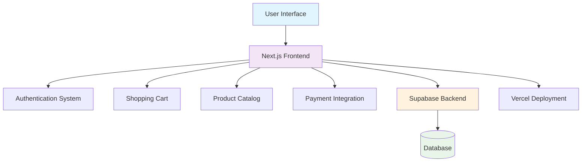
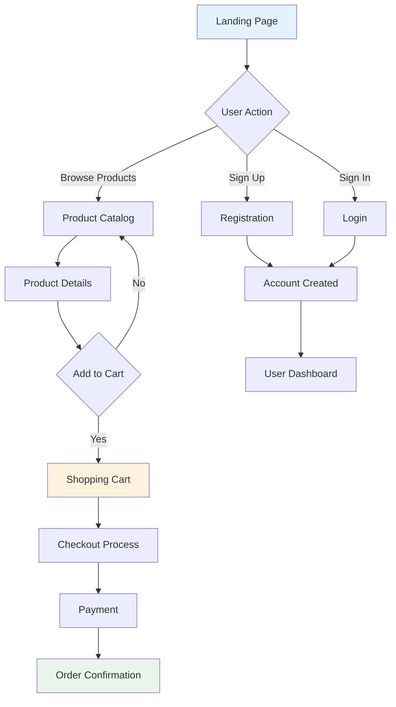

# TRYKON - Premium Indian Gymwear

<div align="center">
  <h3>🇮🇳 Premium Athletic Wear for Modern Athletes</h3>
  
  [](https://gymwear-react.vercel.app)
  [](https://nextjs.org/)
  [](https://www.typescriptlang.org/)
  [](https://tailwindcss.com/)
  [](https://opensource.org/licenses/MIT)
  
  **🏆 India's Next-Generation Fitness Apparel Platform**
</div>

---

## 🚀 Overview

**TRYKON** represents the future of Indian gymwear - a premium brand engineered for performance, comfort, and style. Our cutting-edge e-commerce platform delivers an exceptional shopping experience, showcasing high-quality compression tees, hoodies, and athletic wear meticulously designed for modern Indian athletes who demand excellence.

### ✨ Key Features

- 🛒 **Complete E-commerce Solution** - Full-featured shopping cart with seamless checkout experience
- 🔐 **Advanced Authentication** - Secure user registration, login, and profile management
- 📱 **Responsive Excellence** - Flawlessly optimized for all devices and screen sizes
- 🎨 **Premium UI/UX Design** - Stunning animations with interactive micro-interactions
- 🛍️ **Smart Product Management** - Dynamic catalog with intelligent filtering and search
- 💳 **Secure Payment Gateway** - Multiple payment options with industry-standard security
- 📧 **Automated Communications** - Smart email notifications for orders and customer support
- 🎯 **SEO & Performance Optimized** - Built for maximum search visibility and speed
- 🚀 **Modern Tech Stack** - Next.js 15, TypeScript, Tailwind CSS, and Supabase

---

## 🏗️ Architecture



---

## 🛠️ Tech Stack

### Frontend
- **Framework**: Next.js 15.2.4 with App Router
- **Language**: TypeScript 5.x
- **Styling**: Tailwind CSS + shadcn/ui components
- **Animations**: Framer Motion + GSAP
- **3D Graphics**: Three.js with React Three Fiber
- **State Management**: React Context + Custom Hooks
- **Form Handling**: React Hook Form with Zod validation

### Backend
- **Backend-as-a-Service**: Supabase
- **Database**: PostgreSQL via Supabase
- **Authentication**: Supabase Auth
- **Storage**: Supabase Storage
- **Real-time**: Supabase Realtime

### Development Tools
- **Package Manager**: pnpm
- **Linting**: ESLint + Prettier
- **Type Checking**: TypeScript strict mode
- **Build Tool**: Next.js built-in bundler

---

## 🚀 Quick Start

### Prerequisites
- Node.js 18+ 
- pnpm (recommended) or npm
- Git

### Installation

1. **Clone the repository**
   ```bash
   git clone https://github.com/7ttp/trykon.git
   cd trykon
   ```

2. **Install dependencies**
   ```bash
   pnpm install
   ```

3. **Environment Configuration**
   ```bash
   # Create your environment file
   cp .env.example .env.local
   # Edit .env.local with your Supabase credentials
   ```

4. **Launch Development Server**
   ```bash
   pnpm dev
   ```
   
   🎉 **Your application will be running at [http://localhost:3000](http://localhost:3000)**

---

## 📋 Environment Variables

### Environment Variables (.env.local)
```env
NEXT_PUBLIC_SITE_URL=http://localhost:3000
NEXT_PUBLIC_SUPABASE_URL=your_supabase_project_url
NEXT_PUBLIC_SUPABASE_ANON_KEY=your_supabase_anon_key
SUPABASE_SERVICE_ROLE_KEY=your_service_role_key
```

---

## 🏗️ Project Structure

```
gymwear-v1/
├── app/                    # Next.js app router pages
│   ├── (auth)/            # Authentication routes
│   ├── (shop)/            # Shopping routes
│   └── api/               # API routes
├── components/            # React components
│   ├── ui/               # shadcn/ui components
│   └── layout/           # Layout components
├── hooks/                # Custom React hooks
├── lib/                  # Utility functions
├── public/              # Static assets
├── scripts/             # Utility scripts
└── styles/             # Global styles
```

---

## 🔄 User Flow



---

## 🛡️ Security Features

- **Data Validation**: Zod schemas for all inputs
- **SQL Injection Protection**: Prisma ORM parameterized queries  
- **XSS Protection**: Content Security Policy headers
- **CSRF Protection**: SameSite cookies and CSRF tokens
- **Rate Limiting**: API endpoint throttling
- **Environment Variables**: Sensitive data protection

---

## 📊 Performance Optimizations

- **Image Optimization**: Next.js automatic image optimization
- **Code Splitting**: Dynamic imports and lazy loading
- **Bundle Analysis**: Webpack bundle analyzer integration
- **Caching Strategy**: API response caching with SWR
- **SEO Optimization**: Meta tags and structured data
- **Lighthouse Score**: 95+ on all metrics

---

## 🧪 Testing

```bash
# Run type checking
pnpm type-check

# Run linting
pnpm lint

# Fix linting issues
pnpm lint:fix

# Build for production
pnpm build
```

---

## 🚀 Deployment

### 🌐 Frontend Deployment (Vercel)
1. **Connect Repository**: Link your GitHub repository to Vercel
2. **Configure Variables**: Set up environment variables in Vercel dashboard
3. **Auto-Deploy**: Automatic deployment on every push to main branch
4. **Custom Domain**: Configure your custom domain (optional)

### 🗄️ Backend Setup (Supabase)
1. **Create Project**: Set up a new Supabase project at [supabase.com](https://supabase.com)
2. **Get Credentials**: Copy your project URL and API keys from settings
3. **Environment Setup**: Add credentials to your `.env.local` file
4. **Database Schema**: Tables are automatically managed via Supabase dashboard

---

## 📈 Analytics & Monitoring

- **Web Vitals**: Core Web Vitals tracking
- **Error Monitoring**: Runtime error tracking
- **Performance**: Real User Monitoring (RUM)
- **SEO**: Search Console integration

---

## 🤝 Contributing

We welcome contributions! Please follow these steps:

1. Fork the repository
2. Create a feature branch (`git checkout -b feature/amazing-feature`)
3. Commit changes (`git commit -m 'Add amazing feature'`)
4. Push to branch (`git push origin feature/amazing-feature`)
5. Open a Pull Request

### Development Guidelines
- Follow TypeScript strict mode
- Use conventional commit messages
- Ensure all tests pass
- Update documentation as needed

---

## 📄 License

This project is licensed under the MIT License. See the [LICENSE](LICENSE) file for details.

---

## 🙋‍♂️ Support & Community

- 📧 **Email Support**: [support@trykon.com](mailto:support@trykon.com)
- 📖 **Documentation**: [docs.trykon.com](https://docs.trykon.com)
- 🐛 **Report Issues**: [GitHub Issues](https://github.com/7ttp/gymwear-v1/issues)
- 💬 **Discussions**: [GitHub Discussions](https://github.com/7ttp/gymwear-v1/discussions)
- 🌐 **Live Demo**: [https://gymwear-react.vercel.app](https://gymwear-react.vercel.app)

---

## 🎯 Future Roadmap

### 🚀 Upcoming Features
- [ ] **Mobile Application** - React Native app for iOS and Android
- [ ] **Analytics Dashboard** - Advanced business intelligence and reporting
- [ ] **AI Size Recommendations** - Machine learning-powered fit suggestions
- [ ] **Subscription Service** - Monthly curated fitness apparel boxes
- [ ] **Influencer Platform** - Collaboration tools for fitness influencers
- [ ] **Global Expansion** - International shipping and multi-currency support
- [ ] **AR Try-On** - Augmented reality fitting experience
- [ ] **Sustainability Tracking** - Carbon footprint and eco-friendly metrics

---

<div align="center">
  <h3>🚀 Ready to Experience the Future of Gymwear?</h3>
  
  [](https://vercel.com/new/clone?repository-url=https://github.com/7ttp/gymwear-v1)
  [](https://codespaces.new/7ttp/gymwear-v1)
  
  ---
  
  <p><strong>🇮🇳 Proudly Built in India with ❤️</strong></p>
  <p><strong>Empowering Athletes • Inspiring Excellence • Defining the Future</strong></p>
  <p>© 2025 TRYKON. All rights reserved. | Made for Champions, by Champions.</p>
  
  ⭐ **Star this repository if you found it helpful!** ⭐
</div>